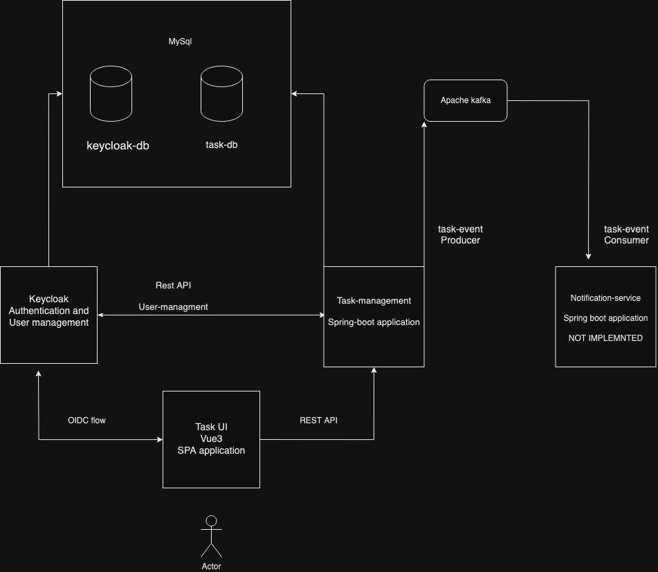

# Pawa-task


## Requirements

For building and running the application you need:

- [JDK 21](https://jdk.java.net/21/)
- [Docker](https://www.docker.com/)

## Running the application locally

1. Run ```docker-compose up```
2. Run ```task-management``` application

There are several ways to run a Spring Boot application on your local machine. One way is to execute the `main` method in the `ee/inbank/decisionengine/DecisionEngineApplication.java` class from your IDE.

Alternatively you can use the gradle wrapper like so:

```shell
./gradlew bootRun
```

Endpoint can be triggered via swagger-ui or front end application

`http://localhost:8080/swagger-ui/index.html`


## Test users

1.
```
username: test
password: test
```

2
```
username: vana-toomas
password: toomas
```

## Architecture




### Description

Implemented parts:
1. Task-management Microservice (Spring Boot application) responsible for task and comment management.
2. MySql database: Single mysql instance with different databases.
3. Keycloak: Keycloak was selected as the primary authentication and user-management solution.
4. Apache-Kafka: Solution for asynchronous communication between microservices.
5. Task-management-ui: SPA Vue.js application as a user interface.


Not implemented parts: 
1. Notification-service: Microservice (Spring Boot application) responsible for scheduling and sending out notifications based on
related users, acts as a consumer to task-events. Not implemented due to time limit. Scheduling part would be implemented based on db-scheduler.

   

## Functionality

User can:

1. Authenticate
2. Add a new task to the list
3. Edit existing task
4. Delete task
5. Add comments to the task
6. Logout

## App limitations and notes:

1. Same database instance but different databases (better to have separate database instances)
2. No pagination implemented and sorting on back-end.
3. No Authorization implemented
4. No LDAP for user management and keycloak integration. Now all the users are managed. (separate user with read reads for task-management service)
5. Getting users is not optimal, can be added some sort of cache.
UserIfnoProvider should be responsible to decide if use cache or ask userInfo from external service.
6. Keycloak version 22 used 23 was released 23 Nov 2023
7. Connection between Kafka and application is not secured
8. Kafka topic is created automatically.
9. Assignee logic not implemented (was not required, but still :) )
10. No localization
11. No test on front-end
12. UI is not 1:1 pixel perfect as prototype, that was not the goal :) .
13. No exception handlers on UI side.
14. No loadres on UI waiting response from API.
15. Tasks are sorted by deadline on front-end.
16. No vue-router on front-end as only 1 page was implemented.
17. Front-end keycloak configuration is hard-coded.
18. Work was not divided by proper commits.

